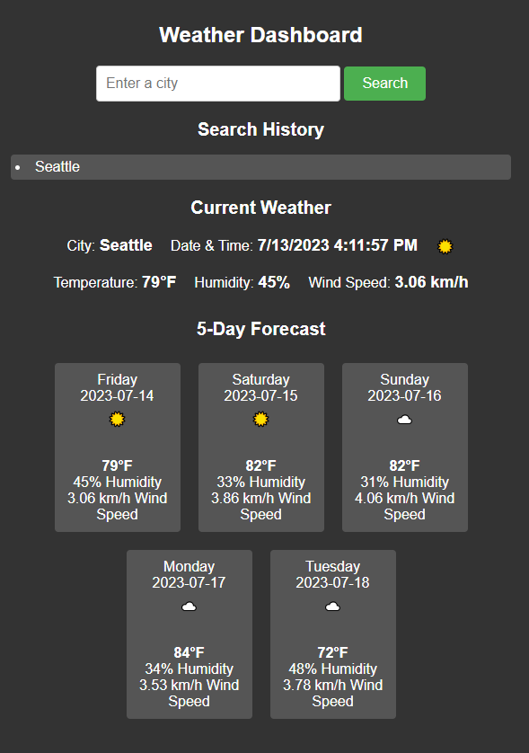

# Weather Application

This is a simple weather application that retrieves and displays current weather data and a 5-day forecast for a given city. The application uses the OpenWeatherMap API to fetch weather data.

## Features

- Display the current weather for a specified city, including temperature, humidity, wind speed, and weather icon.
- Display a 5-day forecast for the specified city, including the date, day of the week, temperature, humidity, wind speed, and weather icon.
- Automatic refresh of the forecast every day at midnight.
- Search history functionality to easily view weather data for previously searched cities.

## Technologies Used

- HTML/CSS: Markup and styling of the user interface.
- JavaScript: Handling of API requests, data processing, and dynamic content generation.
- OpenWeatherMap API: Retrieval of weather data for a given city.
- Fetch API: Asynchronous data fetching from the OpenWeatherMap API.
- Date and time functions: Displaying and updating the current date and time.
- Event handling: Listening for form submission and search history clicks.
- DOM manipulation: Updating and rendering HTML elements based on fetched data.

## Usage

1. Enter a city name in the search input field.
2. Press Enter or click the "Search" button.
3. The current weather for the specified city will be displayed, along with the 5-day forecast.
4. The forecast will be automatically refreshed every day at midnight.
5. Click on a city in the search history to view weather data for that city again.

## Installation

1. Clone the repository: `git clone <repository_url>`
2. Open the project folder.
3. Open the `index.html` file in a web browser.

## API Key

To run the application and fetch weather data, you need to obtain an API key from OpenWeatherMap. Follow these steps:

1. Visit the [OpenWeatherMap website](https://openweathermap.org/) and create an account.
2. After logging in, go to your account dashboard.
3. Navigate to the API Keys section and generate a new API key.
4. Copy the API key.
5. In the application code, replace the `<YOUR_API_KEY>` placeholder with your actual API key.

## Credits

- [OpenWeatherMap](https://openweathermap.org/) for providing the weather data API.

## License

This project is licensed under the [MIT License](LICENSE).

